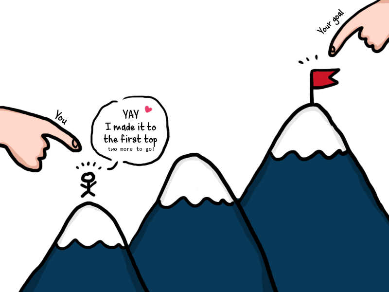

### Coding got me like... 

*Image Source: https://i.imgflip.com/zjaul.jpg*

## My programming skills have greatly improved in the following ways:
- I know how to use HTML and JavaScript files in VSCode. 
For example, what is the difference in the tags if I put .txt. or .html. If I put .txt, it will render it as a text and not a web page. 
When I use the Integrated Terminal, I know that I can start my page using node or nodemon (which is pretty COOL!)
- I know how to use the Inspect function to check for errors.
As a forgotful individual, I always make small mistakes like typing branch instead of brand. I absolutely love using the console to check for errors. 
- I constantly tell myself to put semi-colons.
If you watch my WODs, I am always double checking my lines to make sure they are closed! 
- I can somewhat build a WebPage on my own.
In Assignment 1, I was able to create all the moving parts but not put them together. My coding abilities are a work in progress but I am hopeful that I can do it! 

*Image Source: https://static.makeuseof.com/wp-content/uploads/2019/03/whats-coding-670x335.jpg*

## I need to work on the following to improve my programming skills:

*Image Source: https://th.bing.com/th/id/OIP.X_LqdK4-VMIAiCP9nZFrQwHaGz?pid=Api&rs=1*

- I need to stop waiting til the last minute to ask for help. 
- I need to allocate more time or a time frame to do my ITM 352 work.
- I need to take notes during the screencast instead of watching it only. (Writing down notes will help my comprehension) 
- I need to study more and be confident when picked on in class for Lab exercises. 
- LASTLY, I NEED TO BELIEVE IN MYSELF. Having no confidence will push me back further so learning to trust that I can get it done will help me in the long run. 

## I can do the WODs without looking at the screencast solutions first.
- Yes and no... I try first then look at the WOD solution so I don't think I can do it without some help. It's hard to understand what it is asking me to do 
and executing it in VSCode. I wish that the instructions were more simplified in a way where there's less words and more straight forward steps on what to do. 
I take a super long time and many tries to finish my WODs but I feel accomplished after getting it done. 

## The labs have helped me to learn and I am able to complete them with confidence.
- The labs help but I am not confident after I complete them. There are many gaps after each lessons since I don't take the time to study what I miss and continue 
with the next assignment. It's hard to keep up or ask for help when you don't want to seem inadequate. Therefore, my next goal is to study the material more in-depth
as Professor Port asserts its importance to fully comprehend the topic of the week. 

## I feel ready I am ready to work on the next stage of complexity in programming (building small web applications like Assignment 1).
I defintely do NOT feel ready as my Assignment 1 still does not work. I hope Professor Port gives me a chance to redo my WebPage since I'm not sure where I went wrong. 
I have all the parts but I lack the ability to put them together, which is what I want to work towards in the next assignment.

## I think the class can be improved to help my learning in the following ways:
- Use class time more efficiently (check the time) 
- Allocate time (before class ends) for questions
- Provide more time for Quizzes by posting it earlier and not due the next day 
- Give some motivational quote or message to start the day 

## These are things that work really well for my learning in this class:
- I LOVE AND APPRECIATE THE RECORDED LECTURE VIDEOS. I can pause, take notes, and apply the missed contents to my coding. I am so grateful for the videos,
it allows me to take my time to process what we went over in class and complete the work at my own pace. 
- I like the Chat function in Zoom, fellow peers help when others are struggling. 
- Proffesor Port's enthusiasm in teaching ITM 352 helps with the difficult course subjects
- The satisfication when my codes work like when I created an Invoice, Purchase Button, and Swirly Phones. 

*Image Source: https://i2.wp.com/tasteofthebear.com/wp-content/uploads/2016/06/2.png?resize=800%2C600*
