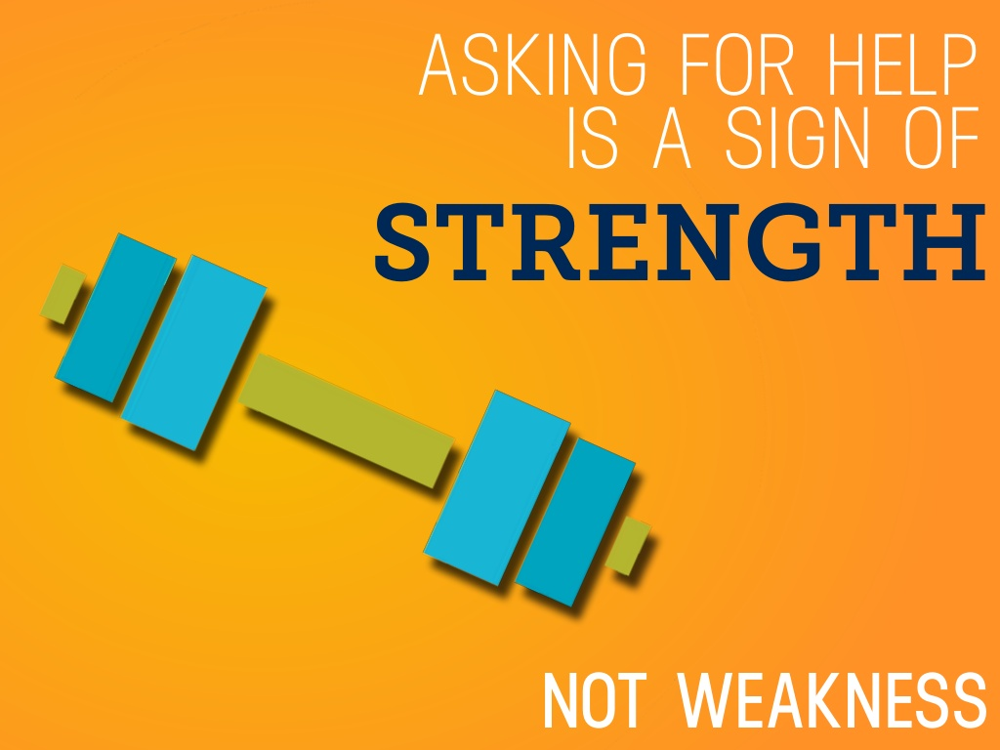
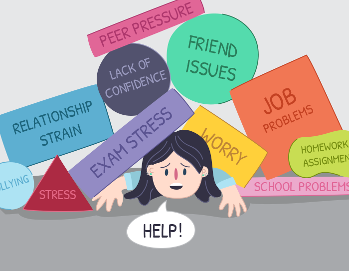
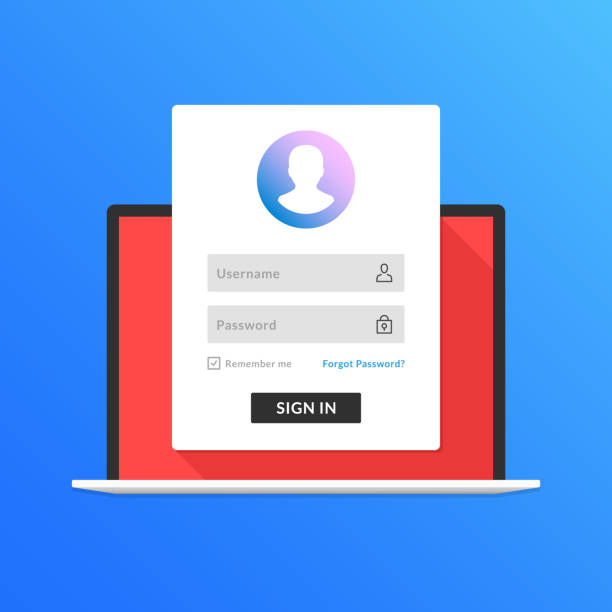
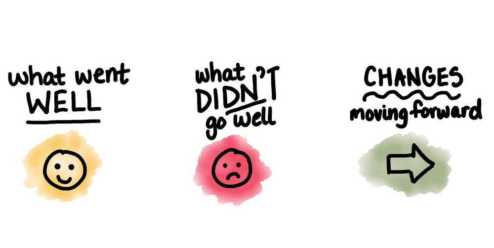

## MAJOR LESSON LEARNED WAS...

*Image Source: https://image.slidesharecdn.com/15lessonsfrom15yearsinbusiness-141014012323-conversion-gate02/95/slide-13-1024.jpg

*Image Source: https://kidshelpline.com.au/sites/default/files/Thumbnail_P_EYPTAFH_2.png

## Provide a brief introduction to the assignment along with a link to this page for further details
According to the original instructions, the task was supposed to be with a partner. 
I kind of wished that the Professor did allow partnership with this assignment as I struggled with the work on my own. 
With Assignment 2, the goal was to add more features to the website that I created. 
I had to create a login and registration page, in which the user would have completed before placing their order. 
To transition from products display, to the login and/or register, and lastly, the invoice page. 
Overall, the purpose is to maintain user data, implement security, and personalize the shopping experience. 
- The link to this assignment: https://dport96.github.io/ITM352/morea/150.Assignment2/experience-Assignment2.html

*Image Source: https://media.istockphoto.com/vectors/registration-page-on-laptop-screen-notebook-and-online-login-form-in-vector-id917229412?k=6&m=917229412&s=612x612&w=0&h=UFxuOcsupgqIoBVtrg9JCzIwSeqpNKG_nbJA9HseHI0=
 
## What did you learn from this assignment?
From the assignment, I learned how to develop a form using the POST method to allow users to enter their information like username and password. 
- It would look like this: <form name="login" method="POST" action="process_login"></form>
I also learned how to place an alert if there is an error when the user does not enter any values, does not meet the requirements, and has to redo the request. 
- It would look like this: if (params.has('login_error')) {alert('Invalid Username and/or Password');}
As a final note, I learned the significance of errors.push code. 
It allows the server to push an array error that the user needs to meet the requirements such as a username with at least 4 characters. 
I liked how a simple function written in the server.js file can make a difference on the web page to force user usage efficiency.
 
## Did you work with a partner? Assign an estimated percentage on the amount each team member contributed to the assignment (including yourself).
Professor Port did not say or allow us to work with a partner for Assignment 2. 
I did ask for guidance on how to create some parts of the assignment from Kylee and Professor. 
 
## How did you get help when you needed it? What did you need help with?
Without a doubt, I had problems with the assignment since my setup was ready to add the features. 
The problems that I had was my Invoice page did not validate the quantities and print when the user placed an order, the Login page did not work with the existing user data, the Registration page did not allow users to create a new profile, and the redirecting of the pages was insufficient. 
Likewise, I tried to fix the errors on my own but was unsuccessful and asked fellow peers for help. 
When that did not work, I turned to the internet research on how they would approach the problem. 
Altogether, I went to the last source of help, which was Professor Port. 
I set up two meetings with him outside of the class hours and was able to resolve some of the problems. 
 

*Image Source: http://www.picgifs.com/clip-art/computer/computers/clip-art-computers-943387.jpg

## How was developing this assignment different than assignment #1?
The development of assignment 2 was different because I had to create more HTML files and add more functions to the server. 
I had to validate the data, create a form, place links to redirect users, and set up requirements for the textbox.
 
## Estimate the % of time you spent (a) thinking about how to do something, (b) writing code (but do not include testing, (c) testing and debugging
To estimate, I spent 50% thinking about what I needed to do, 40% of writing the code, and 10% testing and debugging. 
I am a planner but when I don’t know how to do something, I will likely spend more time organizing the tasks than doing them. 
It was difficult to find the issues that make my webpage not work so I tried my best to figure things out on my own.
 
## Describe what worked well with this project? What did not work well?
What worked well
- I was able to create the HTML files.
- My webpage looks aesthetically pleasing and more original than Assignment #1. 
- All the components were there. 
- I asked for help before the assignment was due. 

What did not work well
- The webpage did not work properly.
- I still struggled with understanding what the function does and why I have issues.
- I don’t know how to debug. 
- The Registration page does not allow users to create an account. 

*Image Source: https://static1.squarespace.com/static/58ae1a931e5b6c0310d9f1e8/t/58bfa3711b10e382364021be/1490766248036/Jiaona+Zhang+Retrospective+Spint+Planning+Agile.jpg

## If you could go back in time and do things differently, what would you do differently?
If I could go back in time, I would construct a detailed timeline of when I plan to do tasks. 
I waited until the last minute to address my issues since I was confident that I could resolve the issues by myself. 
In conclusion, I need to remember that asking for help from the instructor is not a bad thing. 
It’s better to see where the root cause is before continuing down the journey. 
So if I did not fix the problem in Assignment #1, I will not be successful in Assignment #2 as well. 
I hope with having a partner on Assignment #3, I’ll do a better job in coding and meeting the rubric. 
