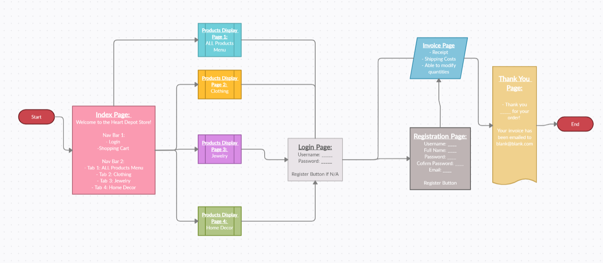
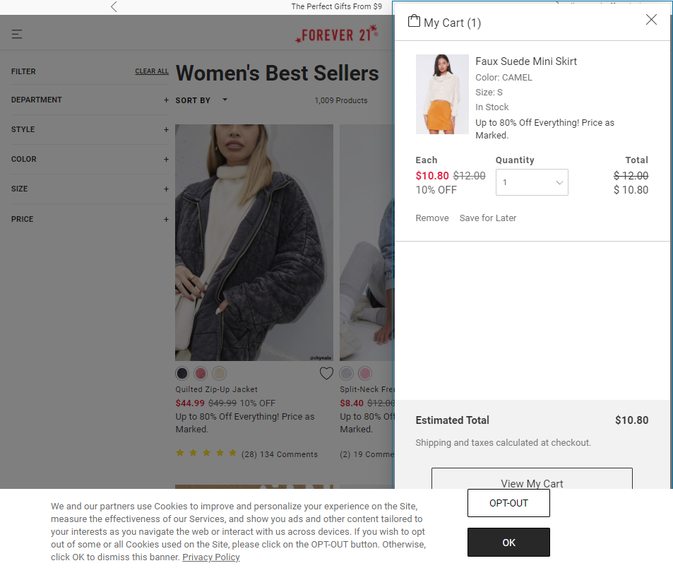
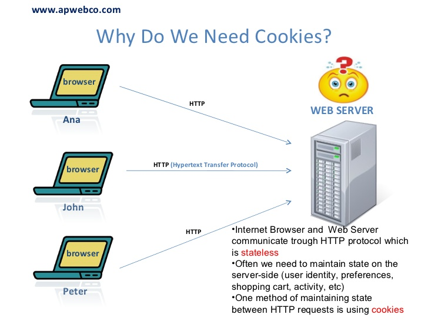
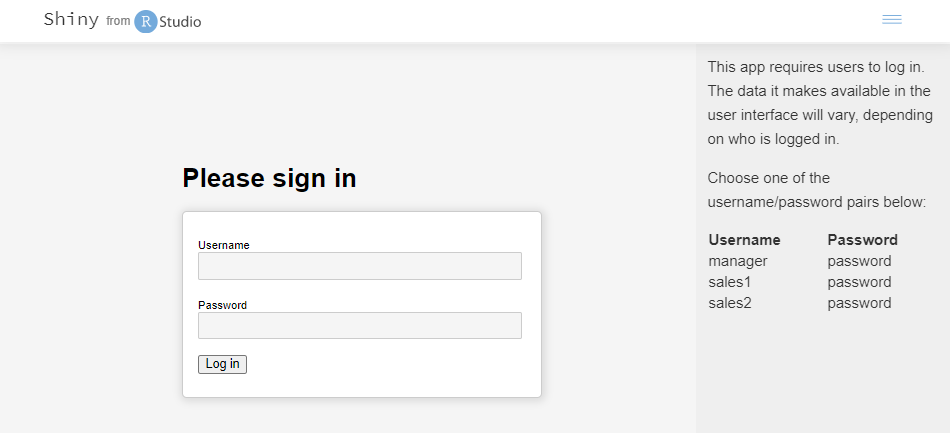
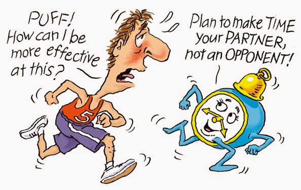

## Show what each page will look like. The pages do not have to be “functional” but the design should clear. 

## Checkpoint A:
Describe your design for your site's shopping cart. That is, will it be a separate page that the user can view and edit, or will it be integrated into the product pages? 
If so, describe in detail how this will work on your site. Provide several examples of using the cart.
- With Assignment 3, I am fortunate to partner up with Kylee. We will be using her Heart Depot store while combining some features from my previous work. 
For our shopping cart, we hope to have it in the navigation bar once the user is on our webpage. 
Like typical stores, you can see your cart as you go along that shows how much items you have so far. 
You would choose your quantities on the product displays page, click add to cart, and in the cart page, it should show the information. 
I did see some examples online, where users can edit their cart in the invoice, I’m hoping to see if I will be able to accomplish this. 

*Image Source: https://www.forever21.com/us/shop/catalog/category/f21/promo-best-sellers-app

## Checkpoint B:
Explain specifically how you will use sessions to manage your shopping cart. 
In particular, what shopping cart data will be stored in the session, what data format will be used (NOT what data type, but the format like with the data format used for your registration data). 
Use code examples showing what data structures (such as arrays and their keys) you will use to manage the shopping cart data and how they will be used in $_SESSION.
- Considering Lab 15, I am thinking about using the cookies function to have the data stored in a session for a certain amount of time. 
Or I would use the app.get code to retrieve the data then app.post to display the total in the invoice. 
Both functions would allow users to shop more efficiently and immediately see what they plan to order accordingly. 

*Image Source: https://image.slidesharecdn.com/webcookies-110726091031-phpapp01/95/web-cookies-3-728.jpg?cb=1311858774

## Checkpoint C:
How will you avoid access to your application when the user has not logged in or registered? What are the particular security concerns you must address?
- As of now, we are not at this step. We still need to address our issues with Assignment 2 before moving on. 
Our meeting with Professor Port this weekend will greatly help us so we can progress to the next step. 
- From research, I saw some ways to secure my website would be using a HTTPS encryption, creating a secure admin account or passwords, and always keeping the webpage up to date. 
- Link Here: https://www.wikihow.com/Secure-Your-Website

## Checkpoint D:
Upon a successful login, how do you provide personalization in your UI? Explain how you did or will do this (paste code if necessary):
- First of all, UI is short for user interface. This is how the webpage features will be designed to interact with users. 
Granted that, to personalize our UI, we will have the login and/or registration pages for the user so they can have a secure account when coming to the store. 
Another thing that I want is a thank you [user name] message after the invoice is completed. 
This is one way to show our users that it is not a routine shopping experience but a customized one to their account. 
I liked when websites greet me so I am looking for ways to welcome them either in the beginning or end. 

*Image Source: https://shiny.rstudio.com/gallery/personalized-ui.html

## Checkpoint E:
If you are working with partners, how will you split up the work in your team so that you are working in parallel as effectively as possible? That is, who is doing what and when?
- As I have mentioned above, my partner is Kylee. We will be meeting multiple times over the next couple of weeks while working on the project on our own time. 
Having the opportunity to meet in person will allow us to discuss our ideas, set time aside to work on the project, and easily see how our codes look on each other’s devices. 
We hope to work on the coding technicalities together in-person then perform on the design aspect on our own. Having a solid, working webpage is our main goal as design can come later. 
After meeting with Professor Port this weekend, we will further split the tasks. We need more clarification on what problems we have in order to move forward.  

*Image Source: http://2.bp.blogspot.com/-kl0KbMRGG3M/VL-nzXzlyBI/AAAAAAAAFx0/cU9FwO7snwo/s1600/Very+funny+Humor+Cartoon+Jokes+on+Time+Management.jpg

## Checkpoint F:
How are you approaching Assignment 3 differently than Assignment 2?
- In Assignment 3, I feel more prepared since I am asking for help ahead of time and have a partner to work with. 
I always try to do things on my own before reaching out, which has proven unsuccessful every time. 
I tend to find errors that I’m not sure how to solve unless I request a meeting with Professor Port. 
For this reason, I have contacted him in advance to see what issues I have now to better understand what I need to do. 
This will save time as I can solve them accordingly and allow more effort to be placed elsewhere. 
Moreover, Kylee and I have scheduled meeting times, which helps with setting time aside to work on the project. 
I usually don’t organize a time to do homework so I find it more efficient to further note when I will be doing them. 
Overall, I am definitely approaching Assignment 3 more differently than Assignment 2 by talking to Professor first on addressing current errors, planning a timetable of events, and regularly exchanging ideas with my partner.
