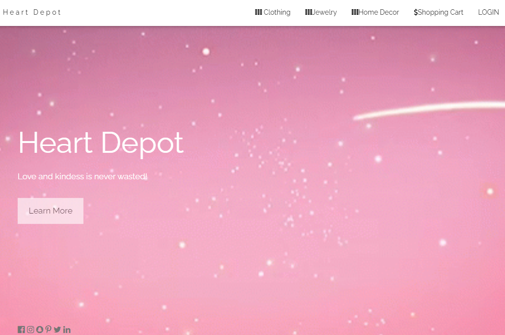
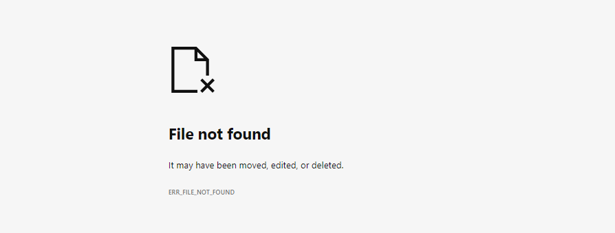
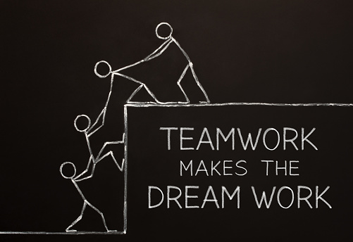
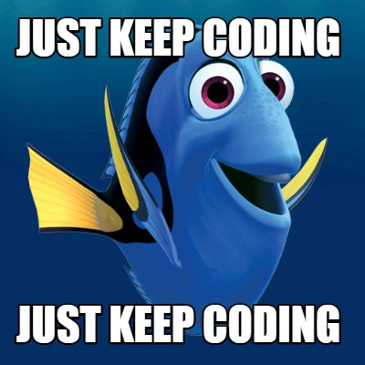
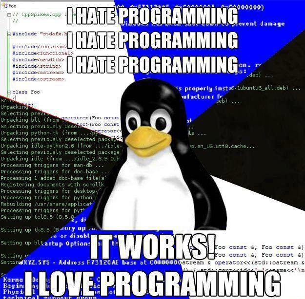

# Webage: Heart Deport
# Partner: Kylee Dean-Kobatake 

## 1. What was accomplished in the project as compared to what was planned?
For Assignment 3, I was fortunate in working with Kylee as my partner. We had a well planned out agenda on what we hope to finish each time we met. For example, establishing times to meet in-person or on Zoom to discuss our progress about Heart Depot. We both applied our previous assignments to enhance the web page with reference to Lab 15 like session cookies. In the end, we accomplished having multiple pages for our three merchandise of clothing, jewelry, and home decor as well as a home, login, registration, invoice, thank you, and shopping cart pages. The layout of the website was more authentic with the help of the W3 schools responsive and bootstrap theme resources. 

## 2. Any notable shortcomings, bugs, problems, or additional features not implemented?
With the website, we were unable to post the invoice data in the confirmation email. We were uncertain why it does not publish what the user desires to purchase but the thank you message did work. If we were to implement everything we planned, it would be that component. 
 
## 3. What was your biggest project risk and how was it managed?
The biggest project risk was ensuring our scheme was more original. We both were marked down for how much it resembled SmartPhone Products 2/3, so it took a long time to change many factors. To manage the risk, we research many websites on what unique features they had. I like when pages have slideshows or a contact us page as it allows the user to easily get the help they need. The W3 school site was an amazing resource since it has a variety of responsive themes to choose from. I simply compile my vision with the codes to make it happen. Altogether, the webpage should look more distinctive than SmartPhone Products 2/3. 

## 4. What is your assessment of the overall quality of the system?
 The webpage looks professional and nearly all functions are operating properly so I am satisfied with the effort we put in. It took many hours but I am appreciative to have had someone guide me through it all because coding is not something I’m proficient in. I enjoy the central appearance and feel of our website with the message on mental health. The Heart Depot is a reminder that you are loved and that you should share that essence with others. I imagine how stressful and overwhelming life can be so it was pleasing to customize a website that aligns with something we are passionate about. 

*Image Source: https://media.istockphoto.com/photos/teamwork-makes-the-dream-work-concept-picture-id1064955772?k=6&m=1064955772&s=170667a&w=0&h=84Y1s3k4ke496_LK9AiWG1umwU_w3XIr0AEQZlTFz9Q=*
 
## 5. What is needed before this system can be placed into operation?
As mentioned above, we wanted to be more creative in our design and improve our errors from Assignment 2. It was like playing hide and seek with the bugs to see what worked. It was new working with cookies and finding ways to make the user experience more protected and like the real sites, we see in real life. In all, I needed to make sure the design does not interfere with the main components of the website so it works and looks nice at the same time. 
 
## 6. Describe what you are most proud of about this project:
Considering the Heart Depot, I am most proud that I did not give up. Coding is not something that I’m strong in but it did not stop me from trying my best. I had so many questions, trial and error, and help from others that made the overall project worthwhile. It was my willingness to keep going even with the uncertainty that it’ll work. Believing in myself makes a difference as I feel less defeated when something doesn’t go my way. Finally, exercising the initiative to ask for help before the deadline was a great effort done. I was able to schedule some meetings with Professor Port and learned what I could do to improve. To conclude, the website has everything we planned to have for the most part. 

*Image Source: https://www.memecreator.org/static/images/memes/4660303.jpg*

## 7. Describe what you are least happy with this project:
With the project, I wish we received feedback from Assignment 2 as I am not sure what errors I had. I continued to proceed with what worked and added more components to meet the requirements. I am least satisfied with not knowing what mistakes I have since I still lack self-confidence in my coding skills. 
 
## 8. Assign an estimated percentage on the amount each team member contributed to the assignment (including yourself) and explain briefly your rationale for the percentage breakdown. 
I believe that Kylee and I gave 110% in the project as we started early, had excellent communication, arranged help sessions with Professor Port, and made sure we were on the same page every step of the way. I worked on the personalization while Kylee did the security elements. We both had working code from Assignment 2 so we added what we learned in Lab 14 and 15 to the website. Overall, our partnership was exceptional and I could not have completed the final project without her!  

## Here are some FUN photos about how coding was for me this semester: 

*Image Source: https://cdn-images-1.medium.com/max/1600/1*RZFpPRHZBIZ62zOo0-GHSA.jpeg*

*Image Source: https://stephenhaunts.files.wordpress.com/2014/09/lol_programming.jpg*

